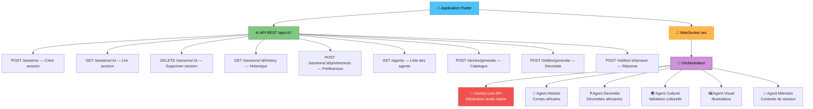
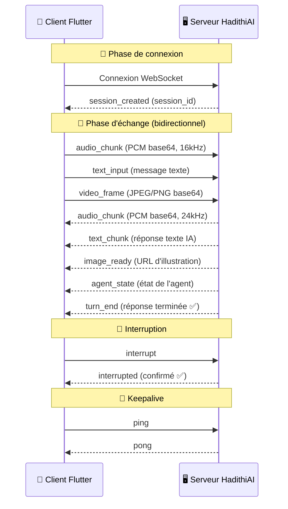
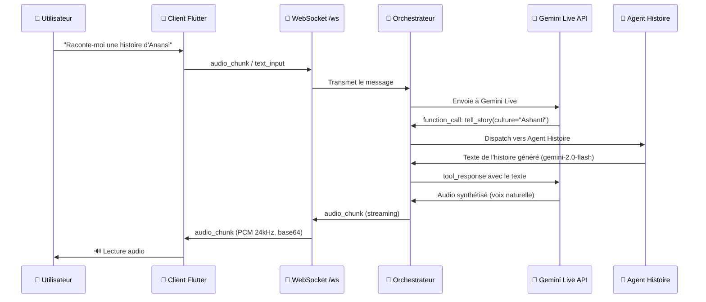

# HadithiAI Orchestrator — Documentation API

> **Version :** 3.0.0  
> **URL de base :** `https://hadithiai-orchestrator-292237971535.us-central1.run.app` (production) ou `http://localhost:8080` (dev)  
> **Protocole :** REST (JSON) + WebSocket (trames JSON)

---

## Table des matières

1. [Démarrage rapide](#démarrage-rapide)
2. [Vue d'ensemble de l'architecture](#vue-densemble-de-larchitecture)
3. [API REST — Gestion des sessions](#api-rest--gestion-des-sessions)
4. [API REST — Catalogue d'histoires](#api-rest--catalogue-dhistoires)
5. [API REST — Jeu de devinettes](#api-rest--jeu-de-devinettes)
6. [WebSocket — Communication temps réel](#websocket--communication-temps-réel)
7. [Spécifications Audio & Vidéo](#spécifications-audio--vidéo)
8. [Système d'agents](#système-dagents)
9. [Modèles de données Flutter](#modèles-de-données-flutter)
10. [Gestion des erreurs](#gestion-des-erreurs)
11. [Guide d'intégration Flutter](#guide-dintégration-flutter)
12. [Configuration](#configuration)

---

## Démarrage rapide

HadithiAI possède **deux canaux de communication** :

| Canal | Endpoint | Rôle |
|-------|----------|------|
| **REST** | `/api/v1/*` | Gestion des sessions, catalogue d'histoires, jeu de devinettes |
| **WebSocket** | `/ws` | **TOUTE la communication temps réel** — audio, texte, vidéo, interruptions |

> ⚠️ **Important :** Il n'y a AUCUN endpoint REST pour l'audio ou la vision.  
> Le streaming audio, le chat texte et les trames vidéo passent TOUS par le WebSocket `/ws`.

### Flux minimal (3 étapes)

```
Étape 1 : POST /api/v1/sessions            → Obtenir un session_id
Étape 2 : Se connecter au WebSocket         → ws(s)://<host>/ws?session_id=<session_id>
Étape 3 : Envoyer/recevoir                  → audio_chunk, text_input, video_frame via WebSocket
```

### Endpoints additionnels (REST)

```
POST /api/v1/stories/generate      → Générer un catalogue d'histoires (StoryCategoryModel)
POST /api/v1/riddles/generate       → Générer une devinette à 4 choix (RiddleModel)
POST /api/v1/riddles/{id}/answer    → Vérifier la réponse d'une devinette
```

---

## Vue d'ensemble de l'architecture

Ce diagramme montre comment l'application Flutter communique avec le serveur :



> 📌 **REST** = gestion de sessions + catalogue d'histoires + jeu de devinettes  
> 📌 **WebSocket** = tout le temps réel (audio bidirectionnel, texte, vidéo, interruptions)  
> 📌 **VAD** = Le serveur filtre le bruit ambiant grâce à un Voice Activity Detector — seul l'audio contenant de la parole est transmis à Gemini

---

## API REST — Gestion des sessions

Tous les endpoints REST utilisent du JSON. Préfixe : `/api/v1`.

> Ces endpoints servent uniquement à gérer les sessions. Ils ne gèrent PAS l'audio, la vidéo ou le streaming temps réel.

### Vérifications de santé

#### `GET /health`
Vérification de base (liveness).

```json
// Réponse 200
{ "status": "healthy", "service": "hadithiai-live" }
```

#### `GET /ready`
Vérification de disponibilité (readiness) avec nombre de connexions actives.

```json
// Réponse 200
{ "status": "ready", "active_connections": 2 }
```

#### `GET /api/v1/health`
Santé détaillée avec uptime et état du pool Gemini.

```json
// Réponse 200
{
  "status": "healthy",
  "service": "hadithiai-live",
  "version": "2.0.0",
  "uptime_seconds": 3600.5,
  "active_sessions": 2,
  "gemini_pool_ready": true
}
```

---

### Sessions

#### `POST /api/v1/sessions` — Créer une session

**Requête :**
```json
{
  "language": "en",        // optionnel, défaut "en"
  "region": "east-africa", // optionnel
  "age_group": "adult"     // optionnel, défaut "adult"
}
```

**Réponse 200 :**
```json
{
  "session_id": "a1b2c3d4e5f6",
  "websocket_url": "wss://hadithiai-orchestrator-292237971535.us-central1.run.app/ws?session_id=a1b2c3d4e5f6",
  "created_at": 1709654400.123
}
```

> 💡 Utilise l'URL `websocket_url` retournée pour ouvrir la connexion WebSocket.

**cURL :**
```bash
curl -X POST https://hadithiai-orchestrator-292237971535.us-central1.run.app/api/v1/sessions \
  -H "Content-Type: application/json" \
  -d '{"language": "en", "age_group": "child"}'
```

---

#### `GET /api/v1/sessions/{session_id}` — Obtenir une session

**Réponse 200 :**
```json
{
  "session_id": "a1b2c3d4e5f6",
  "created_at": 1709654400.123,
  "last_active": 1709654500.456,
  "turn_count": 5,
  "language": "en",
  "region": "east-africa",
  "age_group": "adult"
}
```

**Réponse 404 :** `{ "detail": "Session not found" }`

---

#### `DELETE /api/v1/sessions/{session_id}` — Terminer une session

**Réponse 200 :**
```json
{ "status": "ended", "session_id": "a1b2c3d4e5f6" }
```

---

#### `GET /api/v1/sessions/{session_id}/history` — Obtenir l'historique

| Paramètre | Type | Défaut | Description |
|-----------|------|--------|-------------|
| `limit` | int | 50 | Nombre max de tours à retourner |

**Réponse 200 :**
```json
{
  "session_id": "a1b2c3d4e5f6",
  "turns": [
    {
      "turn_id": "turn_abc123",
      "role": "user",
      "content": "Raconte-moi une histoire d'Anansi",
      "timestamp": 1709654400.0
    },
    {
      "turn_id": "turn_def456",
      "role": "agent",
      "content": "Approchez-vous, mes enfants...",
      "agent": "story",
      "timestamp": 1709654401.0
    }
  ],
  "total": 2
}
```

---

#### `POST /api/v1/sessions/{session_id}/preferences` — Modifier les préférences

**Requête :**
```json
{
  "language": "sw",
  "age_group": "child",
  "region": "west-africa"
}
```

**Réponse 200 :**
```json
{
  "status": "updated",
  "session_id": "a1b2c3d4e5f6",
  "updates": { "language_pref": "sw", "region_pref": "west-africa" }
}
```

---

### Découverte des agents

#### `GET /api/v1/agents` — Lister les agents

**Réponse 200 :**
```json
{
  "agents": [
    {
      "name": "story_agent",
      "description": "Génère des contes africains enracinés dans la tradition orale",
      "capabilities": ["streaming", "visual_moments"]
    },
    {
      "name": "riddle_agent",
      "description": "Crée et gère des devinettes africaines"
    },
    {
      "name": "cultural_grounding",
      "description": "Fournit le contexte culturel et la validation"
    },
    {
      "name": "visual_agent",
      "description": "Génère des illustrations culturellement appropriées"
    },
    {
      "name": "memory_context",
      "description": "Suivi de la mémoire de session et du contexte"
    }
  ],
  "total": 5
}
```

---

## API REST — Catalogue d'histoires

Ces endpoints permettent à l'application Flutter de générer et afficher un catalogue d'histoires africaines.

### `POST /api/v1/stories/generate` — Générer un catalogue

Génère des entrées de catalogue d'histoires correspondant au modèle Flutter `StoryCategoryModel`.

**Requête :**
```json
{
  "culture": "african",       // optionnel, défaut "african"
  "region": "east-africa",    // optionnel, défaut ""
  "count": 5,                 // optionnel, 1-20, défaut 5
  "language": "fr"            // optionnel, défaut "en"
}
```

**Réponse 200 :** `List[StoryCategoryModel]`
```json
[
  {
    "title": "La Sagesse d'Anansi",
    "description": "Anansi l'araignée utilise sa ruse pour collecter toute la sagesse du monde dans un pot — mais le proverbe final lui réserve une surprise.",
    "imageUrl": "",
    "day": 3,
    "month": "January",
    "region": "west-africa"
  },
  {
    "title": "Le Lion et le Lièvre",
    "description": "Un petit lièvre doit arbitrer un conflit entre le lion et le crocodile — un conte Swahili sur l'intelligence face à la force brute.",
    "imageUrl": "",
    "day": 7,
    "month": "January",
    "region": "east-africa"
  }
]
```

> 💡 Les résultats sont mis en cache côté serveur par combinaison `culture + region + language + count`. Un redémarrage vide le cache.

**cURL :**
```bash
curl -X POST https://hadithiai-orchestrator-292237971535.us-central1.run.app/api/v1/stories/generate \
  -H "Content-Type: application/json" \
  -d '{"culture": "african", "region": "west-africa", "count": 5, "language": "fr"}'
```

---

## API REST — Jeu de devinettes

Ces endpoints gèrent le mini-jeu de devinettes avec 4 choix, conçu pour le `RiddleModel` Flutter.

### `POST /api/v1/riddles/generate` — Générer une devinette

Génère une devinette africaine avec 4 propositions de réponse (1 correcte, 3 incorrectes).

**Requête :**
```json
{
  "culture": "East African",       // optionnel, défaut "East African"
  "difficulty": "medium",          // optionnel, "easy" | "medium" | "hard"
  "language": "fr"                 // optionnel, défaut "en"
}
```

**Réponse 200 :** `RiddleModel`
```json
{
  "id": "riddle_a3f7b2c1",
  "question": "Je suis plus grand que Dieu, plus mauvais que le diable. Les pauvres m'ont, les riches en ont besoin. Si tu me manges, tu meurs. Que suis-je ?",
  "choices": [
    {"Rien": true},
    {"L'air": false},
    {"Le soleil": false},
    {"L'eau": false}
  ],
  "tip": "Pense à ce que les pauvres possèdent déjà...",
  "help": "C'est un concept abstrait, pas un objet physique.",
  "language": "fr"
}
```

> ⚠️ **Format des choix :** Chaque choix est un objet `{texte: bool}` où `true` = bonne réponse.  
> Il y a toujours **exactement 4 choix** avec **exactement 1 correct**.  
> L'`id` retourné est nécessaire pour vérifier la réponse via le endpoint suivant.

**cURL :**
```bash
curl -X POST https://hadithiai-orchestrator-292237971535.us-central1.run.app/api/v1/riddles/generate \
  -H "Content-Type: application/json" \
  -d '{"culture": "West African", "difficulty": "easy", "language": "fr"}'
```

---

### `POST /api/v1/riddles/{id}/answer` — Vérifier une réponse

Vérifie si la réponse sélectionnée par l'utilisateur est correcte.

**URL :** `/api/v1/riddles/{riddle_id}/answer`

**Requête :**
```json
{
  "selected_answer": "Rien"
}
```

**Réponse 200 :**
```json
{
  "correct": true,
  "correct_answer": "Rien",
  "explanation": "La réponse est 'rien' car rien n'est plus grand que Dieu, rien n'est plus mauvais que le diable, les pauvres n'ont rien, les riches n'ont besoin de rien, et si tu manges rien, tu meurs."
}
```

**Réponse 404 :**
```json
{ "detail": "Riddle not found or expired" }
```

> 💡 Les devinettes sont stockées en mémoire. Elles expirent au redémarrage du serveur.

**cURL :**
```bash
curl -X POST https://hadithiai-orchestrator-292237971535.us-central1.run.app/api/v1/riddles/riddle_a3f7b2c1/answer \
  -H "Content-Type: application/json" \
  -d '{"selected_answer": "Rien"}'
```

---

## Modèles de données Flutter

Ces modèles correspondent exactement aux classes Dart utilisées dans l'application Flutter.

### `StoryCategoryModel`

```dart
class StoryCategoryModel {
  final String title;       // Titre de l'histoire
  final String description; // Description courte (2-3 phrases)
  final String imageUrl;    // URL de l'illustration (peut être vide)
  final int day;            // Jour du mois (1-30)
  final String month;       // Nom du mois
  final String region;      // Région africaine
}
```

| Champ | Type | Description |
|-------|------|-------------|
| `title` | string | Titre évocateur de l'histoire |
| `description` | string | Description courte (2-3 phrases) |
| `imageUrl` | string | URL de l'illustration (peut être `""`) |
| `day` | int | Jour du mois (1-30) |
| `month` | string | Nom du mois |
| `region` | string | Région africaine (ex: `"west-africa"`, `"east-africa"`) |

### `RiddleModel`

```dart
class RiddleModel {
  final String id;                       // Identifiant unique
  final String question;                 // Texte de la devinette
  final List<Map<String, bool>> choices; // 4 choix: [{texte: true/false}]
  final String? tip;                     // Indice optionnel
  final String? help;                    // Aide optionnelle
  final String? language;                // Langue de la devinette
}
```

| Champ | Type | Description |
|-------|------|-------------|
| `id` | string | Identifiant unique (ex: `"riddle_a3f7b2c1"`) |
| `question` | string | Texte complet de la devinette |
| `choices` | array | Exactement 4 objets `{texte: bool}`, 1 seul `true` |
| `tip` | string? | Indice subtil (optionnel) |
| `help` | string? | Aide plus directe (optionnel) |
| `language` | string? | Code langue (ex: `"fr"`, `"en"`, `"sw"`) |

---

## WebSocket — Communication temps réel

> **C'est l'endpoint principal.** Tout l'audio, le texte, la vidéo et les fonctionnalités interactives passent par ici.

### Connexion

```
ws://<host>/ws?session_id=<session_id_optionnel>
wss://<host>/ws?session_id=<session_id_optionnel>   (production avec TLS)
```

Si `session_id` est omis, le serveur en génère un automatiquement.

### Cycle de vie de la connexion



---

### Messages Client → Serveur

Chaque message est un objet JSON avec un champ `type` :

#### 1. `audio_chunk` — Envoyer de l'audio 🎤

Envoie l'audio du microphone à l'IA. L'IA le traite et répond en audio.

```json
{
  "type": "audio_chunk",
  "data": "<audio PCM encodé en base64>",
  "seq": 1
}
```

- **Format :** PCM 16-bit, 16kHz, mono
- **Taille du chunk :** ~100ms = 3 200 octets bruts → encodé en base64
- **Envoyer en continu** pendant que l'utilisateur parle

---

#### 2. `text_input` — Envoyer un message texte ⌨️

Envoie un message texte au lieu de l'audio.

```json
{
  "type": "text_input",
  "data": "Raconte-moi une histoire d'Anansi",
  "seq": 2
}
```

---

#### 3. `video_frame` — Envoyer une image caméra 📷

Envoie une image de la caméra pour donner du contexte visuel à l'IA (ex : montrer une page de livre).

```json
{
  "type": "video_frame",
  "data": "<JPEG ou PNG encodé en base64>",
  "width": 640,
  "height": 480,
  "seq": 3
}
```

---

#### 4. `interrupt` — Arrêter la réponse en cours 🛑

Arrête immédiatement la réponse de l'IA (comme un bouton stop).

```json
{
  "type": "interrupt",
  "seq": 4
}
```

---

#### 5. `control` — Changer les paramètres

Modifier les réglages en cours de session.

```json
{
  "type": "control",
  "action": "set_language",
  "value": "sw",
  "seq": 5
}
```

---

#### 6. `ping` — Maintien de connexion

```json
{ "type": "ping", "seq": 6 }
```

---

#### 7. `session_init` — Reprendre une session

Se reconnecter à une session existante.

```json
{
  "type": "session_init",
  "session_id": "a1b2c3d4e5f6",
  "seq": 0
}
```

---

### Messages Serveur → Client

#### `session_created`
Envoyé immédiatement après la connexion WebSocket.

```json
{
  "type": "session_created",
  "session_id": "a1b2c3d4e5f6",
  "seq": 1,
  "timestamp": 1709654400.123
}
```

#### `audio_chunk` — Réponse audio de l'IA 🔊
Audio généré par l'IA en streaming. Joue ces chunks au fur et à mesure.

```json
{
  "type": "audio_chunk",
  "data": "<audio PCM encodé en base64>",
  "seq": 2,
  "timestamp": 1709654400.456
}
```

- **Format :** PCM 16-bit, **24kHz**, mono
- Plusieurs chunks arrivent par réponse — les jouer séquentiellement

#### `text_chunk` — Réponse texte de l'IA 💬

```json
{
  "type": "text_chunk",
  "data": "Il était une fois, au pays des Ashanti...",
  "agent": "orchestrator",
  "seq": 3,
  "timestamp": 1709654400.789
}
```

#### `image_ready` — Illustration générée 🖼️

```json
{
  "type": "image_ready",
  "url": "https://storage.googleapis.com/hadithiai-media/img_abc123.png",
  "agent": "visual",
  "seq": 10,
  "timestamp": 1709654410.0
}
```

#### `agent_state` — État de l'agent ℹ️

```json
{
  "type": "agent_state",
  "agent": "story",
  "state": "generating",
  "seq": 4,
  "timestamp": 1709654401.0
}
```

#### `turn_end` — Réponse terminée ✅
L'IA a fini de répondre. Le client peut activer le micro / envoyer la prochaine entrée.

```json
{
  "type": "turn_end",
  "seq": 100,
  "timestamp": 1709654430.0
}
```

#### `interrupted` — Interruption confirmée

```json
{
  "type": "interrupted",
  "seq": 50,
  "timestamp": 1709654415.0
}
```

#### `error` — Erreur

```json
{
  "type": "error",
  "error": "Erreur de traitement IA",
  "seq": 5,
  "timestamp": 1709654402.0
}
```

#### `pong` — Réponse keepalive

```json
{ "type": "pong", "seq": 7, "timestamp": 1709654403.0 }
```

---

## Spécifications Audio & Vidéo

### Format audio

| Direction | Format | Fréquence | Canaux | Profondeur | Encodage |
|-----------|--------|-----------|--------|------------|----------|
| **Client → Serveur** | PCM | 16 000 Hz | Mono | 16-bit | base64 |
| **Serveur → Client** | PCM | 24 000 Hz | Mono | 16-bit | base64 |

- **Durée du chunk :** ~100ms par audio_chunk
- **Taille brute du chunk (entrée) :** 3 200 octets → base64 ≈ 4 267 caractères
- Envoyer en continu pendant que l'utilisateur parle

### Format vidéo

| Propriété | Valeur |
|-----------|--------|
| Format | JPEG ou PNG |
| Encodage | base64 |
| Taille recommandée | 640×480 |
| Usage | Contexte visuel pour l'IA (ex : montrer un livre, un dessin, etc.) |

---

## Système d'agents

HadithiAI utilise 5 sous-agents spécialisés, déclenchés automatiquement par l'IA via le function calling :

| Agent | Déclencheur (automatique) | Ce qu'il fait |
|-------|--------------------------|---------------|
| **Agent Histoire** | L'utilisateur demande une histoire | Génère des contes de la tradition orale africaine (Ashanti, Yoruba, Zulu, Swahili, Maasai) |
| **Agent Devinette** | L'utilisateur veut une devinette | Crée des devinettes africaines avec indices et explications culturelles |
| **Agent Culturel** | Validation interne | Assure la précision culturelle et fournit le contexte |
| **Agent Visuel** | Moment visuel dans l'histoire | Génère des illustrations culturellement appropriées |
| **Agent Mémoire** | Interne | Suit la mémoire de conversation et les préférences utilisateur |

### Comment ça marche (en interne)



> **Tu n'appelles jamais les agents directement.** Parle naturellement à l'IA, et elle route automatiquement vers le bon agent.

---

## Gestion des erreurs

### Erreurs REST

| Code HTTP | Signification |
|-----------|---------------|
| 200 | Succès |
| 404 | Ressource introuvable (session_id invalide) |
| 422 | Erreur de validation (corps de requête invalide) |
| 500 | Erreur interne du serveur |

### Erreurs WebSocket

Les erreurs sont envoyées sous forme de messages de type `error`. Les erreurs fatales ferment la connexion.

| Erreur | Cause | Résolution |
|--------|-------|------------|
| `Server initialization failed: timed out` | Timeout de connexion à l'API Gemini | Réessayer la connexion WebSocket |
| `1008 Operation not supported` | Session Gemini expirée | Se reconnecter avec une nouvelle session |
| `Session not found` | session_id invalide | Créer une nouvelle session via REST |

---

## Guide d'intégration Flutter

### Flux complet

```dart
import 'dart:convert';
import 'package:http/http.dart' as http;
import 'package:web_socket_channel/web_socket_channel.dart';

const baseUrl = 'https://hadithiai-orchestrator-292237971535.us-central1.run.app';

// ─── Étape 1 : Créer une session (REST) ───
final response = await http.post(
  Uri.parse('$baseUrl/api/v1/sessions'),
  headers: {'Content-Type': 'application/json'},
  body: jsonEncode({
    'language': 'en',
    'age_group': 'child',
  }),
);
final session = jsonDecode(response.body);
final sessionId = session['session_id'];

// ─── Étape 2 : Connecter le WebSocket ───
final wsUrl = 'wss://hadithiai-orchestrator-292237971535.us-central1.run.app/ws?session_id=$sessionId';
final channel = WebSocketChannel.connect(Uri.parse(wsUrl));

// ─── Étape 3 : Écouter les réponses ───
channel.stream.listen((message) {
  final msg = jsonDecode(message);
  
  switch (msg['type']) {
    case 'session_created':
      print('Connecté ! Session : ${msg['session_id']}');
      break;
      
    case 'audio_chunk':
      // Décoder base64 → octets PCM → jouer l'audio (24kHz, 16-bit, mono)
      final audioBytes = base64Decode(msg['data']);
      audioPlayer.playPcm(audioBytes, sampleRate: 24000);
      break;
      
    case 'text_chunk':
      // Afficher un sous-titre
      showCaption(msg['data']);
      break;
      
    case 'image_ready':
      // Afficher l'illustration générée
      showImage(msg['url']);
      break;
      
    case 'turn_end':
      // L'IA a fini → activer le microphone
      enableMicrophone();
      break;
      
    case 'interrupted':
      // Interruption confirmée
      break;
      
    case 'error':
      print('Erreur : ${msg['error']}');
      break;
  }
});

// ─── Étape 4 : Envoyer l'audio du microphone ───
int seq = 1;

void onMicrophoneData(List<int> pcmBytes) {
  channel.sink.add(jsonEncode({
    'type': 'audio_chunk',
    'data': base64Encode(pcmBytes),  // PCM 16kHz, 16-bit, mono
    'seq': seq++,
  }));
}

// ─── Étape 5 : Envoyer du texte au lieu de l'audio ───
void sendText(String text) {
  channel.sink.add(jsonEncode({
    'type': 'text_input',
    'data': text,
    'seq': seq++,
  }));
}

// ─── Étape 6 : Interrompre l'IA ───
void interrupt() {
  channel.sink.add(jsonEncode({
    'type': 'interrupt',
    'seq': seq++,
  }));
}

// ─── Étape 7 : Envoyer une image caméra (optionnel) ───
void sendCameraFrame(List<int> jpegBytes) {
  channel.sink.add(jsonEncode({
    'type': 'video_frame',
    'data': base64Encode(jpegBytes),
    'width': 640,
    'height': 480,
    'seq': seq++,
  }));
}

// ─── Nettoyage ───
await channel.sink.close();
await http.delete(Uri.parse('$baseUrl/api/v1/sessions/$sessionId'));
```

### Exemple Flutter — Catalogue d'histoires

```dart
// ─── Générer un catalogue d'histoires ───
Future<List<StoryCategoryModel>> getStories() async {
  final response = await http.post(
    Uri.parse('$baseUrl/api/v1/stories/generate'),
    headers: {'Content-Type': 'application/json'},
    body: jsonEncode({
      'culture': 'african',
      'region': 'east-africa',
      'count': 5,
      'language': 'fr',
    }),
  );
  final List<dynamic> data = jsonDecode(response.body);
  return data.map((s) => StoryCategoryModel.fromJson(s)).toList();
}
```

### Exemple Flutter — Jeu de devinettes

```dart
// ─── Générer une devinette ───
Future<RiddleModel> getRiddle() async {
  final response = await http.post(
    Uri.parse('$baseUrl/api/v1/riddles/generate'),
    headers: {'Content-Type': 'application/json'},
    body: jsonEncode({
      'culture': 'West African',
      'difficulty': 'medium',
      'language': 'fr',
    }),
  );
  return RiddleModel.fromJson(jsonDecode(response.body));
}

// ─── Vérifier la réponse ───
Future<bool> checkAnswer(String riddleId, String selectedAnswer) async {
  final response = await http.post(
    Uri.parse('$baseUrl/api/v1/riddles/$riddleId/answer'),
    headers: {'Content-Type': 'application/json'},
    body: jsonEncode({'selected_answer': selectedAnswer}),
  );
  final result = jsonDecode(response.body);
  if (result['correct']) {
    print('Bravo ! Bonne réponse !');
  } else {
    print('Mauvaise réponse. La bonne réponse était : ${result['correct_answer']}');
    print('Explication : ${result['explanation']}');
  }
  return result['correct'];
}
```

### Résumé pour le développeur Flutter

| Ce que tu veux faire | Comment faire |
|----------------------|---------------|
| Créer une session | `POST /api/v1/sessions` |
| Envoyer de l'audio à l'IA | WebSocket → envoyer des messages `audio_chunk` |
| Recevoir l'audio de l'IA | WebSocket → écouter les messages `audio_chunk` |
| Envoyer du texte à l'IA | WebSocket → envoyer un message `text_input` |
| Recevoir le texte de l'IA | WebSocket → écouter les messages `text_chunk` |
| Envoyer une image caméra | WebSocket → envoyer un message `video_frame` |
| Recevoir des illustrations | WebSocket → écouter les messages `image_ready` |
| Arrêter la réponse de l'IA | WebSocket → envoyer un message `interrupt` |
| Savoir quand l'IA a fini | WebSocket → écouter le message `turn_end` |
| Obtenir l'historique | `GET /api/v1/sessions/{id}/history` |
| Supprimer la session | `DELETE /api/v1/sessions/{id}` |
| **Générer un catalogue d'histoires** | `POST /api/v1/stories/generate` |
| **Générer une devinette (4 choix)** | `POST /api/v1/riddles/generate` |
| **Vérifier une réponse de devinette** | `POST /api/v1/riddles/{id}/answer` |

---

## Configuration

Variables d'environnement (définies dans Cloud Run ou `.env` pour le dev local) :

| Variable | Défaut | Description |
|----------|--------|-------------|
| `HADITHI_GEMINI_API_KEY` | — | **Obligatoire.** Clé API Google Gemini |
| `HADITHI_PROJECT_ID` | `hadithiai-live` | ID du projet GCP |
| `HADITHI_REGION` | `us-central1` | Région GCP |
| `HADITHI_GEMINI_MODEL` | `gemini-2.5-flash-native-audio-latest` | Modèle Gemini Live API |
| `HADITHI_GEMINI_TEXT_MODEL` | `gemini-2.0-flash` | Modèle de génération de texte |
| `HADITHI_GEMINI_VOICE` | `Zephyr` | Voix pour la synthèse audio |
| `HADITHI_GEMINI_POOL_SIZE` | `3` | Nombre de sessions Gemini préchauffées |
| `HADITHI_DEBUG` | `false` | Activer les logs de débogage |
| `HADITHI_LOG_LEVEL` | `INFO` | Niveau de log |
| `HADITHI_MAX_CONCURRENT_SESSIONS` | `200` | Nombre max de connexions WebSocket simultanées |
