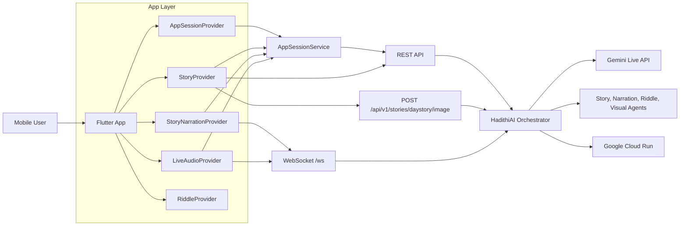

# HadithiAI

HadithiAI is a Live Agents challenge submission focused on real-time storytelling and learning.

## Challenge Submission Checklist

### 1) Public Code Repository URL

- https://github.com/glosings0n/hadithiai

### 2) Reproducible Spin-up Instructions

Prerequisites:
- Flutter SDK 3.35+
- Dart SDK (bundled with Flutter)
- Android Studio or VS Code with Flutter tooling
- Android/iOS emulator or physical device

Quick start:

```bash
git clone https://github.com/glosings0n/hadithiai.git
cd hadithiai
flutter pub get
flutter run
```

Validation:

```bash
flutter analyze
```

Backend target used by this app:
- Cloud Run API base URL is configured in [lib/core/constants/api_constants.dart](lib/core/constants/api_constants.dart)
- Current value: https://hadithiai-orchestrator-292237971535.us-central1.run.app

### 3) Proof of Google Cloud Deployment

Google Cloud proof is provided through one of the following:

- Option A: a short recording proving backend is running on Google Cloud (Cloud Run console page or live logs)
- Option B: a repository code link proving usage of Google Cloud services/APIs

Code evidence links:
- Cloud Run backend URL config: [lib/core/constants/api_constants.dart](lib/core/constants/api_constants.dart)
- Live API docs on deployed backend: [https://hadithiai-orchestrator-292237971535.us-central1.run.app/docs](https://hadithiai-orchestrator-292237971535.us-central1.run.app/docs)
- Frontend API contract consumed from orchestrator: [https://github.com/AbraImani/hadithiAI_orchestrator/blob/master/docs/API_DOCUMENTATION.md](https://github.com/AbraImani/hadithiAI_orchestrator/blob/master/docs/API_DOCUMENTATION.md)
- Story generation API calls from app:
	- [lib/core/services/api_service.dart](lib/core/services/api_service.dart)
	- [lib/core/providers/story_provider.dart](lib/core/providers/story_provider.dart)

Cloud Run deployment screenshot:


Other proof:
- Recording URL (Cloud Run proof): [LINK_HERE]
- Optional backend repository/code proof link: https://github.com/AbraImani/hadithiAI_orchestrator

### 4) Architecture Diagram



Judge visibility tip:
- Export this diagram as PNG and include it in the file upload/image carousel so it is easy to find.

## What HadithiAI Does

- It generates a Story of the Day using cultural metadata (id, title, summary, language, region)
- It generates story illustrations via a dedicated image endpoint
- It provides a read-aloud narration mode
- It supports real-time voice interaction with interruption handling
- It includes riddle gameplay with scoring and hints
- It provides a library of daily story seeds

## API Flow Used by the App

- Text story generation: POST /api/v1/stories/daystory
- Story image generation: POST /api/v1/stories/daystory/image
- Session lifecycle and history: /api/v1/sessions/*
- Realtime audio: WebSocket /ws

Reference docs:
- [https://github.com/AbraImani/hadithiAI_orchestrator/blob/master/docs/API_DOCUMENTATION.md](https://github.com/AbraImani/hadithiAI_orchestrator/blob/master/docs/API_DOCUMENTATION.md)

## Tech Stack


Core packages:
- provider
- dio
- web_socket_channel
- flutter_pcm_sound
- record
- cached_network_image
- intl

## Project Structure

```text
lib/
	core/
		constants/
		data/
		models/
		providers/
		services/
		widgets/
	features/
		home/
		story/
		riddle/
		live_audio/
		library/
```

## Judges Quick Links

- App entrypoint: [lib/main.dart](lib/main.dart)
- Session service: [lib/core/services/app_session_service.dart](lib/core/services/app_session_service.dart)
- Story provider: [lib/core/providers/story_provider.dart](lib/core/providers/story_provider.dart)
- API service: [lib/core/services/api_service.dart](lib/core/services/api_service.dart)
- API contract: [https://github.com/AbraImani/hadithiAI_orchestrator/blob/master/docs/API_DOCUMENTATION.md](https://github.com/AbraImani/hadithiAI_orchestrator/blob/master/docs/API_DOCUMENTATION.md)
